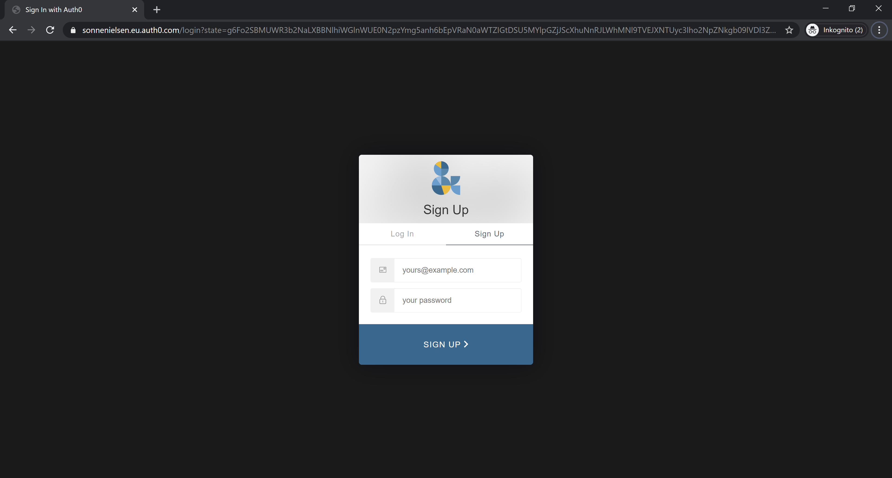
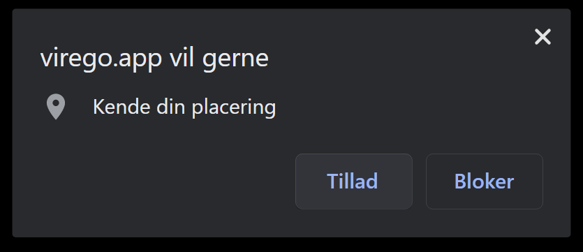
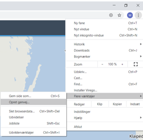

# Sådan kommer du i gang
{: .no_toc }

Når du skal bruge Virego første gang.
{: .fs-6 .fw-300 }

## Oversigt
{: .no_toc .text-delta }

1. TOC
{:toc}

---

## Sign up

Gå ind i en Chrome, Firefox eller Safari og gå til [virego.app](https://virego.app)   (Virego understøtter ikke Internet Explorer)

Her skal du vælge ’sign up’, skriv din e-mail og vælg et personligt password
Du modtager nu en e-mail i din indbakke, som du skal bekræfte 
Herefter kan du gå tilbage til www.virego.app og vælge ’Log in’
Log ind med din e-mail og det valgte password
Så er du klar til at arbejde i Virego 😊

Nedenfor kan du se en video om hvordan du kommer i gang med virego:

## Tillad adgang til din fysiske placering

I Chrome bliver du spurgt om du vil give virego.app adgang til din fysiske placering.

Klik på 'tillad' hvis du ønsker at Virego skal centrere kortet i forhold til din fysiske placering.

## Opret genvej (Chrome)

Find de tre horisontale prikker i højre hjørne af din skærm. Ikonet hedder ‘Tilpas Google Chrome’ 
Vælg ‘Flere værktøjer’
Vælg ‘Opret genvej’
Klik ‘Opret’
Virego ligger nu tilføjet på sin hjemmeskærm

## iPhone og iPad

## Android